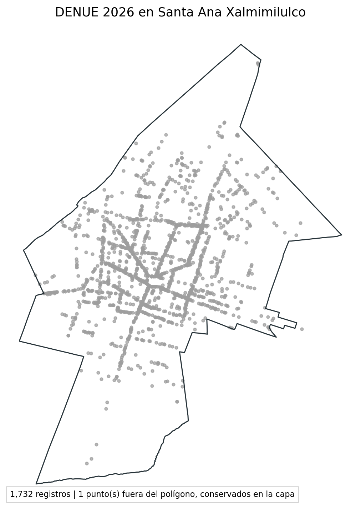
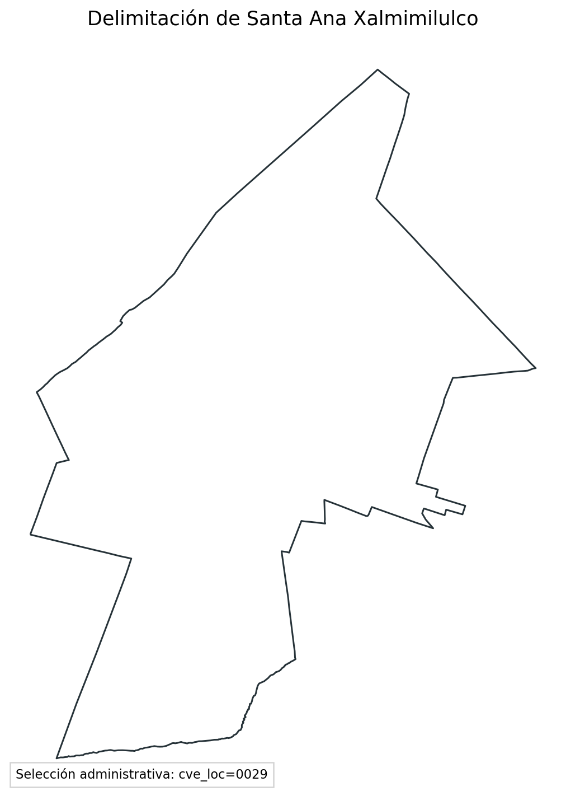
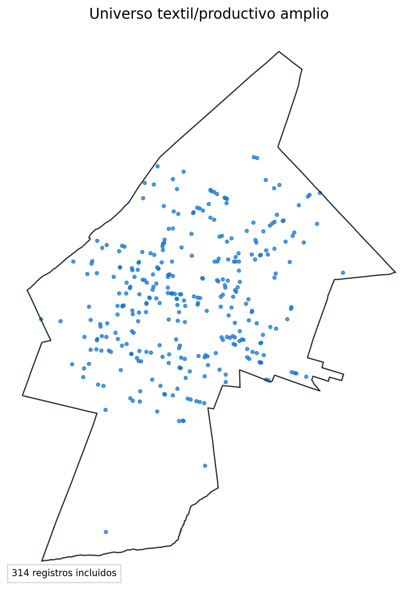
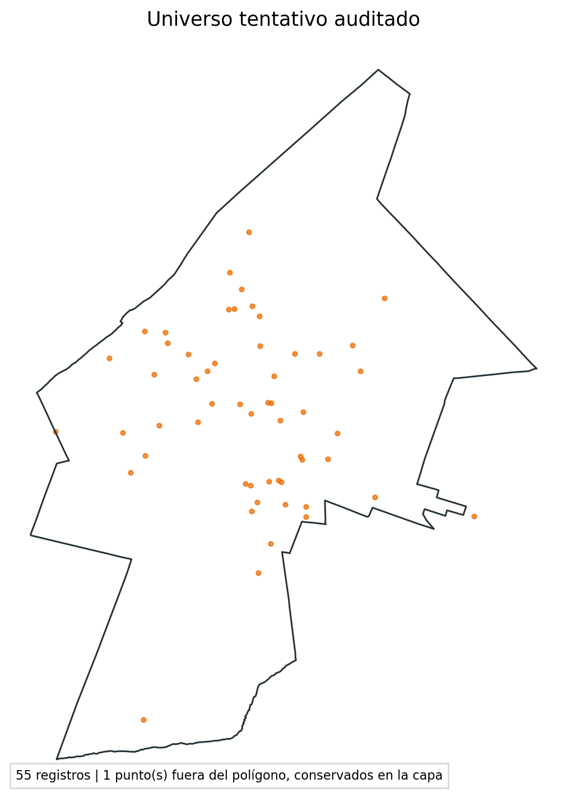
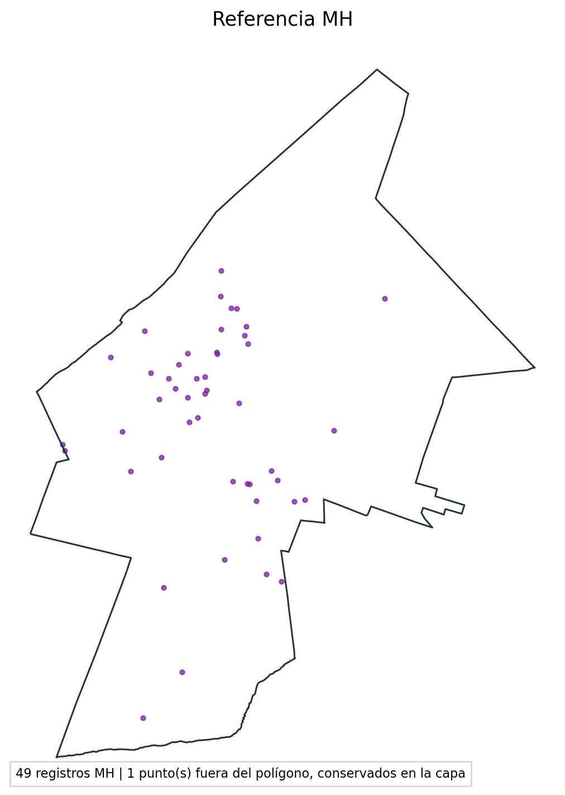
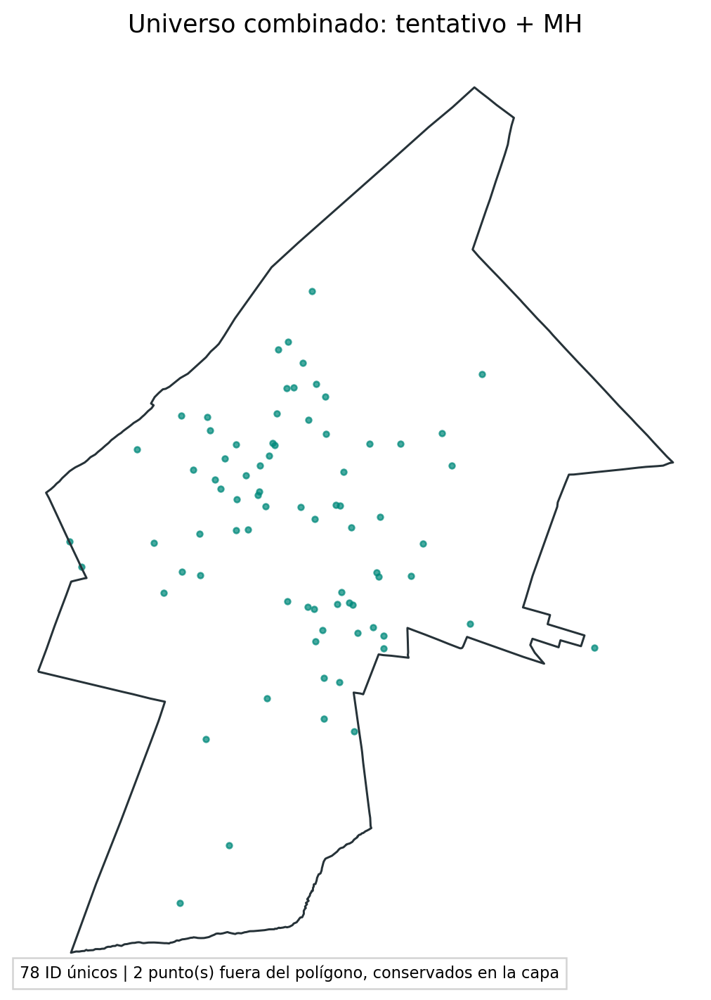

# Construcción auditable del universo textil e hídrico de Santa Ana Xalmimilulco

## 1. Objetivo y alcance

Este documento registra el procedimiento reproducible seguido para pasar del DENUE 2026 a dos productos distintos: **el universo tentativo auditado**, construido con reglas independientes y decisiones humanas, y **el universo combinado tentativo + MH**, que agrega la referencia histórica de MH sin convertirla retroactivamente en una regla del filtro inicial.

La unidad de análisis es el **registro de establecimiento**. Un registro DENUE no equivale necesariamente a una empresa única ni a un sitio físico único. CLEE diferentes, como los dos registros próximos de Stone Lav, se conservan para trazabilidad aunque posteriormente puedan agruparse como un mismo complejo operativo.

## 2. Entradas

1. DENUE 2026: atributos de identificación, CLEE, nombre, razón social, SCIAN, personal ocupado, domicilio, contacto, coordenadas, tipo de unidad y fecha de alta.
2. Polígono/localidad administrativa: Santa Ana Xalmimilulco, seleccionada con `cve_loc=0029`.
3. Catálogos externos editables: códigos SCIAN, palabras clave, matriz de decisión, política de categorías y política de refinamiento.
4. MH: referencia externa comparada sólo después de materializar el universo independiente.
5. Auditorías humanas: lavanderías, maquila y producción.

El DENUE territorial contiene **1732 registros**. Esta capa conserva todos los giros; todavía no representa el universo textil.

## 3. Delimitación territorial

La selección efectiva se hace por el atributo administrativo `cve_loc=0029`. El polígono se usa como representación cartográfica y comprobación espacial, no como sustituto silencioso del código administrativo. Esto evita perder registros por pequeñas discrepancias entre puntos y límites geométricos.

## 4. Universo textil/productivo amplio

El filtrado automático combina:

- código y descripción SCIAN;
- nombre del establecimiento y razón social;
- términos de evidencia textil, mezclilla, maquila, lavado, teñido y acabado;
- términos de exclusión o contradicción;
- una matriz de prioridades que devuelve `INCLUIR`, `REVISAR` o `EXCLUIR` y conserva la regla decisiva.

El resultado amplio contiene **314 registros**. La clasificación inicial no lee MH ni el canónico. Por eso puede compararse posteriormente sin circularidad metodológica.

### 4.1 Catálogo SCIAN utilizado

El archivo externo `config/filtros_textiles_santa_ana/versiones/v1/codigos_scian.csv` define los códigos y no los oculta dentro del script:

| Código | Coincidencia | Interpretación |
|---|---|---|
| 313 | prefijo | fabricación de insumos y acabado textil; evidencia alta |
| 314 | prefijo | productos textiles excepto prendas; evidencia media |
| 315 | prefijo | confección de prendas; pertenencia productiva, no prueba hídrica |
| 8122 | prefijo | lavandería/tintorería; candidato para revisar |
| 313310 | exacto | acabado de productos textiles; señal húmeda alta |
| 812210 | exacto | lavandería/tintorería que necesita contexto para separar industria de servicio comercial |
| 46 | prefijo | comercio; señal de exclusión salvo evidencia productiva que la supere |

### 4.2 Catálogo de palabras

El catálogo completo está en `palabras_clave.csv` y cada fila guarda término, grupos, etapa del proceso, universo, nivel de evidencia, función y nota. Los grupos principales son:

- **textil/material:** textil, textilera, tela, tejido, tejeduría, telar, hilado, hilo y fibra textil;
- **mezclilla:** mezclilla, mesclilla, denim, jean, jeans y frases de pantalón o prendas de mezclilla;
- **húmedo:** lavado industrial/textil/de prendas, deslavado, prelavado, enjuague, stone wash, acid wash, teñido, tintura, blanqueo, mercerizado, enzimas, sosa cáustica, colorante, baño químico, suavizado, neutralizado, centrifugado y oxidante;
- **producción/maquila:** maquila textil, maquila de ropa/prendas/mezclilla, confección en serie, ensamble y taller textil;
- **alertas ambiguas:** acabado, tratamiento, estampado, serigrafía, sublimación, bordado o maquila sin objeto explícito;
- **seco o menor prioridad hídrica:** corte, costura, confección, deshebrado, bordado, over, recta, hojal, ensamble y planchado;
- **comercio/exclusión:** venta, tienda, boutique, mayoreo, distribuidora, comercializadora, outlet, bazar, mercería, renta y alquiler;
- **no textil:** autolavado, mecánica, vehículos, reparación de lavadoras, carpintería, herrería, medicina, calzado, bolsos, maletas y publicidad;
- **contradicciones:** bodega, desperdicio, productos para lavandería, servilleta y recuerdo.

La detección se realiza sobre la concatenación normalizada de nombre, razón social y actividad DENUE. Una palabra no decide sola: produce banderas que después interpreta la matriz. Así, `lavandería` aislada manda a revisión, mientras `lavandería industrial`, `lavado de prendas` o SCIAN 313310 aportan evidencia más fuerte.

### 4.3 Matriz de decisión y precedencia

La matriz externa se evalúa de mayor a menor prioridad; se aplica la primera fila cuyas banderas obligatorias, alternativas y prohibidas se cumplen:

| Prioridad | Regla | Resultado |
|---:|---|---|
| 100 | exclusión fuerte no textil | EXCLUIR |
| 98 | coincidencia genérica sin SCIAN/evidencia textil | EXCLUIR |
| 95 | lavandería contradicha por bodega/desperdicio | REVISAR |
| 90 | comercio o nombre excluido no superado por evidencia productiva | EXCLUIR |
| 80 | texto o código de proceso húmedo | INCLUIR_ALTA |
| 70 | maquila + evidencia textil/mezclilla | INCLUIR_MEDIA |
| 60 | mezclilla o jeans explícitos | INCLUIR_MEDIA |
| 50 | SCIAN textil o producción + texto textil | INCLUIR_MEDIA |
| 40 | lavado genérico | REVISAR |
| 30 | maquila sola | REVISAR |
| 20 | señal textil ambigua | REVISAR |
| 0 | sin evidencia suficiente | FUERA |

La política de categorías traduce esas decisiones en tres universos: principal, revisión y exclusión. El universo amplio incluye categorías productivas; los casos ambiguos se conservan en colas de revisión en lugar de borrarse.

## 5. Refinamiento y auditorías posteriores

La etapa de refinamiento separa pertenencia al giro textil de pertinencia hídrica. Tintorerías comerciales se excluyen del foco productivo; procesos húmedos explícitos conservan prioridad alta; actividades de confección o maquila sin evidencia de lavado permanecen sujetas a revisión.

### 5.1 Política de refinamiento

`politica_refinamiento.csv` aplica cuatro reglas ordenadas:

1. SCIAN 812210 + nombre de tintorería, sin señal industrial/productiva: `EXCLUIR_ALCANCE` por servicio comercial.
2. Tintorería con señal industrial o de proceso: `REVISAR`.
3. Caso originalmente `INCLUIR_ALTA`: `RETENER`, prioridad alta.
4. Resto del universo productivo: `RETENER`, prioridad media.

La única excepción que consulta MH en esta etapa es explícita y trazable: una lavandería genérica que estaba en revisión puede entrar como `INCLUIR_POR_MH`, prioridad media. MH no altera la clasificación inicial de los demás registros.

### 5.2 Segregación posterior de procesos secos

La exclusión de “seco” no significa que el establecimiento deje de ser textil. Significa que se retira del **universo hídrico prioritario** cuando el único proceso declarado es seco.

En maquila y producción se examina el nombre normalizado con esta precedencia:

`húmedo explícito > mezclilla explícita > seco explícito > acabado ambiguo > proceso no declarado`.

- **Húmedo explícito:** lavado, lavandería, deslave, stone/acid wash, teñido, blanqueo, mercerizado, enzimas, sosa, colorante, baño químico, suavizado, decolorado, neutralizado, centrifugado, enjuague u oxidante → `INCLUIR_PROCESO_HUMEDO`, prioridad alta.
- **Mezclilla explícita:** mezclilla, mesclilla, denim o jeans → `INCLUIR_POR_MEZCLILLA`, inclusión precautoria media si no hay señal húmeda. No se afirma automáticamente que exista lavado.
- **Seco explícito:** corte, costura, confección, deshebrado, bordado, over, recta, hojal, ensamble, presilla, etiquetado, dobladillo o armado → `EXCLUIR_SECO` del universo hídrico.
- **Planchado:** se trata como seco/consumo indirecto insuficiente para prioridad hídrica.
- **Acabado, terminado, preparado o elaboración sin técnica:** permanece `REVISAR`.
- **Maquila o producción sin proceso declarado:** permanece `REVISAR`.

Si aparecen señales contrapuestas, húmedo prevalece sobre mezclilla y mezclilla sobre seco. Esto evita excluir, por ejemplo, un establecimiento que menciona corte y lavado a la vez.

### 5.3 Seis casos especiales

| ID | Caso | Dictamen especial | Prioridad/razón |
|---:|---|---|---|
| 3427952 | Maquila de lavandería de pantalón | CONFIRMAR | alta; SCIAN 313310 y lavado explícito |
| 3428321 | Lavandería y Terminados G C | CONFIRMAR | alta; evidencia pública de mezclilla |
| 3428329 | Poliproceso | CONFIRMAR | alta; acabado textil SCIAN 313310 |
| 6861846 | Stone Lav | CONFIRMAR | alta; evidencia industrial y procesos de lavado |
| 10262715 | Impresos en servilletas para recuerdo | REVISAR_NO_TEXTIL | SCIAN textil, pero objeto/material y proceso no comprobados |
| 10451408 | Ston/Stone Lav | REVISAR_DUPLICADO | CLEE distinto y coordenada cercana; no se elimina automáticamente |

Estado de las auditorías utilizadas:

| Auditoría | Estado leído |
|---|---:|
| Lavanderías | 19 completadas de 20 |
| Maquila | 33 completadas de 155 pendientes enviados |
| Producción | 8 completadas de 76 pendientes enviados |

Sólo se incorporan automáticamente decisiones con `estado_revision_manual=COMPLETADO` y un dictamen que comienza con `INCLU`. Los dictámenes pendientes no se interpretan como inclusión ni como exclusión definitiva. Se toleran las variantes `INCLUIR` e `INCLUR`, pero se conservan textualmente para auditoría.

## 6. Universo tentativo auditado

El universo tentativo auditado contiene **55 registros** y reúne:

- procesos húmedos confirmados por las reglas y la auditoría especial;
- inclusiones de la auditoría manual de lavanderías;
- casos automáticos de maquila o producción con evidencia explícita de mezclilla/proceso hídrico;
- inclusiones manuales completadas de maquila y producción.

Se denomina **tentativo** porque quedan revisiones pendientes y porque DENUE describe el giro registrado, no verifica la operación actual, el consumo de agua ni el proceso observado en campo.

La prioridad final se expresa deliberadamente sólo como **alta** o **media** para los integrantes del tentativo: **11 altas** y **44 medias**. Los registros que aparecen únicamente por MH no reciben una prioridad inventada; su decisión queda como `NO_INCLUIDO_EN_TENTATIVO` y su fundamento como `SOLO_REFERENCIA_MH_SIN_PRIORIDAD_PROPIA`.

## 7. Referencia MH

MH contiene **49 registros administrativos**. De ellos, **43** traen un ID DENUE utilizable: **42** tienen correspondencia con el DENUE 2026 cargado y **1** no tienen correspondencia directa. Además, **6** filas de MH no proporcionan ID DENUE. Todas se conservan con la geometría y el nombre disponibles en MH, marcadas como tales; no se inventan atributos DENUE.

La coincidencia se determina por ID DENUE normalizado, no por similitud de nombre ni cercanía espacial. Por eso posibles duplicados físicos permanecen como registros separados mientras no exista un dictamen explícito de agrupación.

## 8. Universo combinado tentativo + MH

El universo combinado contiene **78 registros únicos por ID**:

- **26** presentes tanto en el universo tentativo como en MH;
- **29** presentes sólo en el tentativo;
- **23** presentes sólo en MH.

Esta unión es un producto de cobertura máxima para planeación y revisión de campo. No debe presentarse como si todos sus integrantes estuvieran confirmados con el mismo nivel de evidencia. La columna `resultado_comparacion` mantiene la procedencia de cada registro.

## 9. Productos entregados

- `universo_tentativo_auditado.gpkg`, `.csv` y `.xlsx`: producto construido por reglas y auditorías.
- `universo_combinado_tentativo_mh.gpkg`, `.csv` y `.xlsx`: unión máxima con MH.
- `tabla_maestra_combinada_enriquecida.xlsx`: tabla de auditoría completa del combinado, con DENUE, enlaces, MH, decisiones y prioridad.
- `tabla_maestra_tentativa_enriquecida.xlsx`: la misma estructura limitada a los 55 integrantes del tentativo.

La tabla maestra enriquecida contiene 76+ columnas organizadas en: identificación DENUE; SCIAN; domicilio y contacto; coordenadas; tres enlaces de auditoría; pertenencia al tentativo y a MH; resultado de comparación; fuente automática de inclusión; origen y contenido de la auditoría manual; dictamen especial; decisión final `INCLUIR_ALTA/INCLUIR_MEDIA`; prioridad final y fundamento. Por ello es el archivo recomendado para lectura registro por registro.
- `comparacion_hidrico_preliminar_vs_mh.gpkg`: compatibilidad con el nombre anterior.
- `figuras/`: seis representaciones cartográficas del flujo.
- `resumen_comparacion_mh.csv`: conteos de intersección y diferencias.

## 10. Lectura correcta y limitaciones

El SCIAN es evidencia sectorial, no prueba de proceso. Un teléfono, correo o web vacío significa ausencia en DENUE, no inexistencia del negocio. Las coordenadas pueden ser aproximadas. La fecha de alta es la incorporación al directorio y no necesariamente la fecha de apertura. Finalmente, el universo combinado amplía cobertura, mientras que el universo tentativo conserva mayor independencia metodológica.
